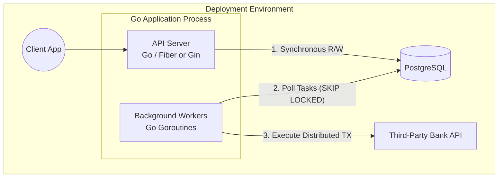
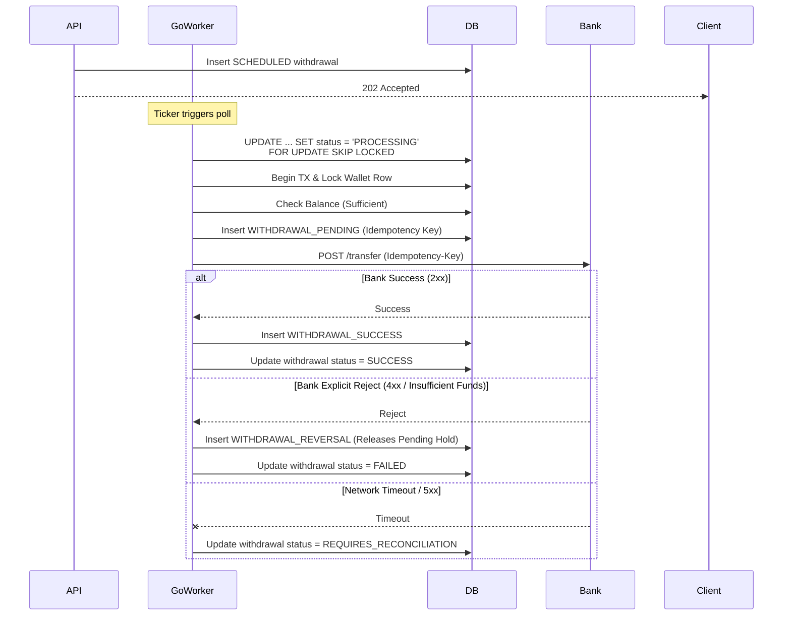

# Technical Specification: Scheduled Wallet Service

## 1. Executive Summary

This document outlines the architecture and design for a highly reliable Wallet Service capable of handling synchronous deposits and asynchronous, time-delayed withdrawals. Designed to be lightweight yet robust, the system leverages a lean stack of **Golang** and **PostgreSQL** to achieve enterprise-grade data integrity, concurrency safety, and seamless horizontal scalability.

### 1.1 Core Architectural Decisions & Trade-offs

| Decision                    | Choice                                  | Rationale & Trade-offs                                                                                                                                                                                                                       |
| :-------------------------- | :-------------------------------------- | :------------------------------------------------------------------------------------------------------------------------------------------------------------------------------------------------------------------------------------------- |
| **Orchestration**           | **Go Workers + Postgres `SKIP LOCKED`** | Uses standard Postgres features for high-concurrency, lock-free polling. Eliminates the need for heavy external message brokers (like Kafka or RabbitMQ) while maintaining reliable task execution.                                          |
| **Balance Validation**      | **Strict (Execution-Time)**             | Funds are _not_ held at the time of scheduling. Balance is verified exactly at the `execute_at` timestamp. This strictly satisfies the domain requirements and simplifies the model by eliminating long-lived "pending holds."               |
| **Data Model**              | **Append-Only Ledger**                  | The industry standard for financial systems. Wallets do not have a mutable `balance` column. Available balance is derived dynamically from the sum of immutable ledger entries, ensuring strict auditability and preventing race conditions. |
| **Currency Representation** | **Integers (Minor Units)**              | All monetary amounts are stored and calculated as `BIGINT` (e.g., cents/minor units). This eliminates floating-point rounding errors native to system architectures.                                                                         |

---

## 2. High-Level System Design (HLD)

The system is decomposed into a single, cohesive Go application containing two logical domains: a stateless HTTP API server and a background Worker Pool, both interfacing with a central PostgreSQL database.

### 2.1 System Architecture Diagram



## 3. Data Model & Database Design (LLD)

We utilize a Double-Entry / Append-Only Ledger approach. Concurrency and double-spending protections are handled strictly at the database level using Postgres row-level locking.

### 3.1 Schema Definition

```SQL
-- 1. Wallets Table (Used primarily for Row-Level Locking)
CREATE TABLE wallets (
    id UUID PRIMARY KEY DEFAULT gen_random_uuid(),
    created_at TIMESTAMPTZ DEFAULT NOW()
);

-- 2. Ledger Entries (The Source of Truth for Balances)
CREATE TYPE ledger_type AS ENUM ('DEPOSIT', 'WITHDRAWAL_PENDING', 'WITHDRAWAL_SUCCESS', 'WITHDRAWAL_REVERSAL');
CREATE TABLE ledger_entries (
    id UUID PRIMARY KEY DEFAULT gen_random_uuid(),
    wallet_id UUID REFERENCES wallets(id),
    amount BIGINT NOT NULL,       -- Represented in minor units
    type ledger_type NOT NULL,
    idempotency_key UUID UNIQUE,  -- Crucial for Bank API reconciliation
    reference_tx_id VARCHAR(255), -- External Bank Transaction ID
    created_at TIMESTAMPTZ DEFAULT NOW()
);
CREATE INDEX idx_ledger_wallet_id ON ledger_entries(wallet_id);

-- 3. Scheduled Withdrawals (Task Queue Table)
CREATE TYPE withdrawal_status AS ENUM ('SCHEDULED', 'PROCESSING', 'SUCCESS', 'FAILED', 'REQUIRES_RECONCILIATION');
CREATE TABLE scheduled_withdrawals (
    id UUID PRIMARY KEY DEFAULT gen_random_uuid(),
    wallet_id UUID REFERENCES wallets(id),
    amount BIGINT NOT NULL,
    execute_at TIMESTAMPTZ NOT NULL,
    status withdrawal_status DEFAULT 'SCHEDULED',
    created_at TIMESTAMPTZ DEFAULT NOW(),
    updated_at TIMESTAMPTZ DEFAULT NOW()
);

-- Crucial Index for the Polling Worker
CREATE INDEX idx_scheduled_polling ON scheduled_withdrawals(execute_at)
WHERE status = 'SCHEDULED';
```

## 4. Workflows & Concurrency Management

### 4.1 The Concurrency Lock Pattern (Preventing Double-Spending)

Whenever funds are added or removed (deposits or delayed execution), the system executes the following SQL pattern inside a database transaction:

```SQL
BEGIN;
-- 1. Lock the wallet row. Concurrent requests for this specific wallet will queue here.
SELECT id FROM wallets WHERE id = $1 FOR UPDATE;

-- 2. Calculate current available balance on the fly
SELECT COALESCE(SUM(CASE WHEN type IN ('DEPOSIT', 'WITHDRAWAL_SUCCESS') THEN amount
                         WHEN type = 'WITHDRAWAL_PENDING' THEN -amount ELSE 0 END), 0)
FROM ledger_entries WHERE wallet_id = $1;

-- 3. Insert Ledger Entry if sufficient funds, else rollback.
COMMIT;
```

### 4.2 Background Worker Design (SKIP LOCKED)

A pool of Go goroutines acts as the distributed task runner. On a ticker, the worker pool executes a query to claim tasks:

```SQL
UPDATE scheduled_withdrawals
SET status = 'PROCESSING', updated_at = NOW()
WHERE id = (
    SELECT id
    FROM scheduled_withdrawals
    WHERE status = 'SCHEDULED' AND execute_at <= NOW()
    ORDER BY execute_at ASC
    FOR UPDATE SKIP LOCKED
    LIMIT 1
)
RETURNING id, wallet_id, amount;
```

Note: SKIP LOCKED ensures that if multiple worker goroutines or horizontally scaled application pods run concurrently, they will instantly skip over rows locked by other workers and grab the next available task, completely avoiding race conditions without locking the entire table.

### 4.3 Sequence Diagram: Execution & Network Partition Handling



## 5. Edge Cases & Constraints Resolution

### 5.1 The "Refund" Requirement

To fulfill the requirement to "return the amount to the wallet if necessary" upon failure:
By using an append-only ledger, if a transaction fails after a WITHDRAWAL_PENDING hold is placed, the worker inserts a WITHDRAWAL_REVERSAL ledger entry. This mathematically restores the available balance sum, fulfilling the refund requirement without mutating past historical rows.

### 5.2 Graceful Shutdown

Because the system utilizes native Go workers, handling application termination is critical to prevent data inconsistency.
The Worker pool listens for OS interrupt signals (SIGINT/SIGTERM).
Upon receiving a shutdown signal, the pool stops pulling new tasks but waits for in-flight tasks (e.g., HTTP calls to the Bank) to finish or hit their context timeout before allowing the application process to exit.

### 5.3 Distributed Saga Reconciliation

To ensure eventual consistency across system boundaries, a secondary reconciliation worker runs periodically. It processes rows stuck in REQUIRES_RECONCILIATION by querying the bank API using GET /transfer/{idempotency_key} to determine if the timed-out transfer ultimately succeeded or failed, and finalizes the ledger accordingly.

## 6. Assumptions & External Service Contract

To ensure Strong Consistency during network partitions, the architecture assumes the provided 3rd-party bank API supports:

1. Idempotency: Accepts an Idempotency-Key header to safely retry requests without duplicating transfers.
2. Status Query: Exposes a reconciliation endpoint to check the final status of a previously submitted Idempotency-Key.
